### <code>tanishkbisht584-ux@github ~ $ whoami</code>

<table>
  <tr>
    <td valign="top"><picture>
  <source media="(prefers-color-scheme: dark)" srcset="https://raw.githubusercontent.com/tanishkbisht584-ux/tanishkbisht584-ux/main/ascii-dark.svg">
  <source media="(prefers-color-scheme: light)" srcset="https://raw.githubusercontent.com/tanishkbisht584-ux/tanishkbisht584-ux/main/ascii-light.svg">
  
</picture></td>
    <td valign="top">
 
</td>
  </tr>
</table>

  

### <code>tanishkbisht584-ux@github ~ $ cat stack.txt</code>

  

### <code>tanishkbisht584-ux@github ~ $ ./contributions.sh</code>

  

<picture>
  <source media="(prefers-color-scheme: dark)" srcset="https://raw.githubusercontent.com/tanishkbisht584-ux/tanishkbisht584-ux/output/github-snake-dark.svg" />
  <source media="(prefers-color-scheme: light)" srcset="https://raw.githubusercontent.com/tanishkbisht584-ux/tanishkbisht584-ux/output/github-snake.svg" />
  
</picture>

  

### <code>tanishkbisht584-ux@github ~ $ git log --stat</code>

  

&nbsp;&nbsp;

